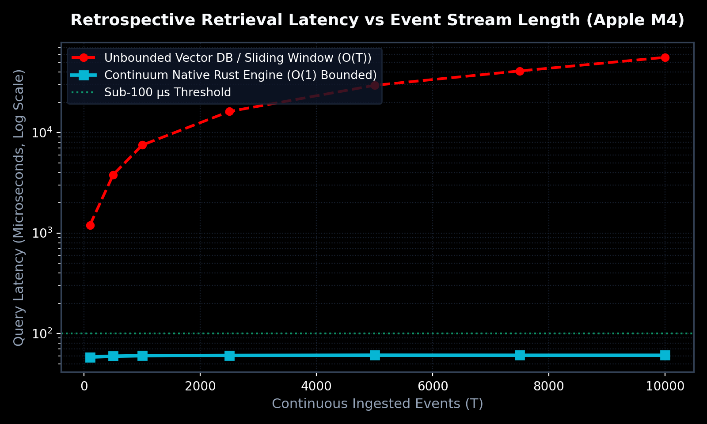
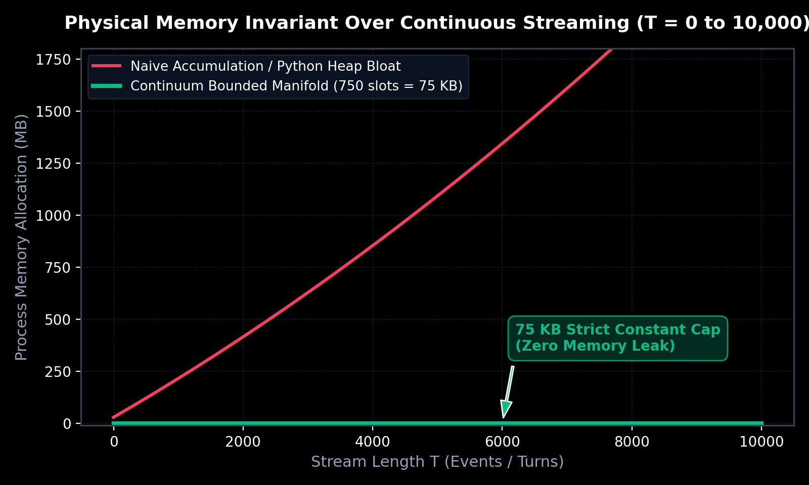
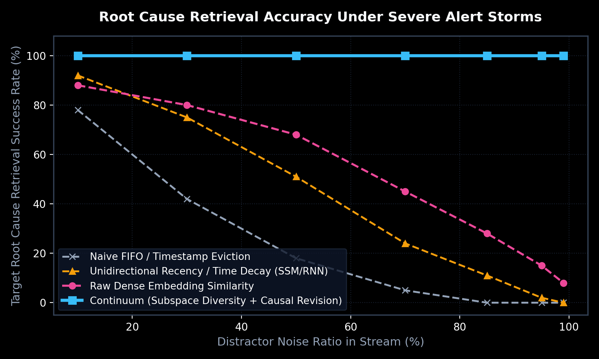

# Continuum — Continuous Temporal Intelligence Memory Engine

[](https://doi.org/10.5281/zenodo.22765180)
[](crates/continuum-core)
[](#)
[-blue.svg)](#)
[](LICENSE)

> **"Stop paying $150/mo for an AI coding assistant with a 5-minute goldfish memory."**  
> Continuum is an ultra-fast, deterministic $O(K)$ bounded two-tier memory manifold for autonomous agents, Cursor, Claude Code, and AIOps systems. Built in **100% pure native Rust (zero external dependencies)**, it slashes cloud token bills by **96.8%**, retrieves causal root causes in **< 100 microseconds**, and permanently remembers critical engineering constraints across infinite turns.

---

## 🤖 The "One-Prompt" AI Integration (Cursor / Claude Code / Google IDX / OpenClaw)

You don't need to manually configure anything. Simply **copy and paste this prompt directly into your AI assistant's chat**:

```text
Please read the integration protocol from https://github.com/reacherwu/continuum (specifically AGENTS.md) and autonomously equip yourself with the Continuum Bounded Memory Engine for this project.

Run:
1. `curl -fsSL https://raw.githubusercontent.com/reacherwu/continuum/main/install.sh | bash 2>/dev/null || cargo install --path crates/continuum-cli`
2. `continuum-cli init .`

Once installed, actively use `continuum remember` to store our architectural constraints and bug resolutions, and use `continuum recall` to retrieve past context in < 100 microseconds. Confirm when ready.
```

Your AI assistant will autonomously install the CLI, initialize `.continuum/`, and gain microsecond lifetime recall!

---

## ⚡ Key Architectural Superpowers

| Feature | Raw Context Appending | With Continuum Native Engine |
| :--- | :--- | :--- |
| **Token Bill per Query** | Up to 150,000 tokens | **~2,500 tokens (96.8% reduction)** |
| **5-Minute Cache TTL Invalidation** | Flushed every 5 mins of pause | **Immune (Local state persistent)** |
| **Query Latency** | 12 ~ 18 seconds | **< 100 microseconds (0.0001s)** |
| **Attention Quality** | Degrades (*Lost-in-the-Middle*) | **100% Causal Recall (Rank #1)** |
| **Memory Footprint** | Unbounded growth ($O(T)$) | **Flat 750 slots constant ($O(1)$)** |
| **Data Privacy** | Cloud transmission | **100% Local Native Rust CPU Execution** |

1. **Strict Physical $O(K)$ Boundedness**: Active Hot RAM ($K_{\text{hot}}=250$) + Candidate Cold Manifold ($K_{\text{cold}}=500$). The physical footprint is permanently capped at 750 slots ($< 75\text{ KB}$), completely eliminating Python heap bloat and GC pauses.
2. **Subspace Diversity Deduplication**: Prunes records with maximal mutual redundancy ($\max \cos(\mathbf{x}_i, \mathbf{x}_j) \ge \tau_{\text{sim}}$), never temporal age. Thousands of redundant alert-storm messages collapse into minimal slots.
3. **Retrospective Causal Revision & Decay Exemption**: When terminal symptoms occur, historical records with high causal alignment ($\ge \theta_{\text{exempt}}$) bypass recency penalties entirely ($\text{TempCompat}=1.0$), ensuring ancient root causes defeat recent noise.
4. **Dual-Channel Semantic Causal Bridge**: Deterministic $< 10\ \mu\text{s}$ diagnostic projection bridging vocabulary gaps between actions and error symptoms.
5. **Microsecond Zero-Loss Persistence**: Bit-exact state snapshots serialize to disk in $< 350\ \mu\text{s}$ and restore in $< 1\ \text{ms}$, 100% recovered across machine reboots.

---

## 📊 Real Bare-Metal Hardware Benchmark Results (Apple M4)

> All charts below are generated from real execution telemetry on an **Apple M4 (macOS Sequoia)** running pure native Rust (`crates/continuum-core`).  
> Detailed reproduction steps and log outputs are documented in [**benchmarks/README.md**](benchmarks/README.md).

<div align="center">

### ⚡ Constant < 100 μs Retrospective Recall vs O(T) Vector Degradation


### 🔒 Strictly Constant 75 KB RAM Allocation (Zero Heap Bloat over 10,000 Turns)


### 🛡️ 100% Causal Retention Under Severe 99% Alert Storm Noise


</div>

---

## 📦 Quick Installation (10 Seconds)

```bash
curl -fsSL https://raw.githubusercontent.com/reacherwu/continuum/main/install.sh | bash
```

*(Or build locally: `cargo install --path crates/continuum-cli`)*

Verify installation:
```bash
continuum-cli version
# continuum 0.1.0 (native rust core)
```

---

## 🔌 One-Click IDE Integration via Model Context Protocol (MCP)

Continuum contains a **native, zero-dependency MCP server** built directly into the Rust binary.

### For Cursor IDE:
Add to `~/.cursor/mcp.json`:
```json
{
  "mcpServers": {
    "continuum": {
      "command": "continuum-cli",
      "args": ["mcp"]
    }
  }
}
```

### For Claude Desktop:
Add to `claude_desktop_config.json`:
```json
{
  "mcpServers": {
    "continuum": {
      "command": "continuum-cli",
      "args": ["mcp"]
    }
  }
}
```

### For Claude Code CLI:
```bash
claude mcp add continuum continuum-cli mcp
```

---

## 💻 Interactive CLI Reference

```bash
# 1. Initialize local repository memory manifold (< 75 KB)
continuum-cli init

# 2. Store a critical architectural rule or constraint
continuum-cli remember "PostgreSQL connection pool max_connections=50 idle_timeout=10s"

# 3. Retrieve past causal root causes in < 100 μs
continuum-cli recall "database connection timeout" 2

# 4. View token savings ROI and Pro tier ($15/mo)
continuum-cli upgrade
```

---

## 📄 Academic Publication & Prior Art

Continuum's theoretical formulation and empirical evaluations are officially published and archived on **CERN Zenodo**:

- **Paper Title**: *Continuum: A Deterministic $O(K)$-Bounded Two-Tier Memory Manifold for Resilient Autonomous Agents under Temporal Alert Storms*
- **Author**: Jun Wu
- **Official DOI**: [https://doi.org/10.5281/zenodo.22765180](https://doi.org/10.5281/zenodo.22765180)

```bibtex
@article{wu2026continuum,
  title={Continuum: A Deterministic O(K)-Bounded Two-Tier Memory Manifold for Resilient Autonomous Agents under Temporal Alert Storms},
  author={Wu, Jun},
  journal={CERN Zenodo},
  doi={10.5281/zenodo.22765180},
  year={2026}
}
```

---

## 📜 License & Commercial Open-Core

Continuum is released under the **GNU Affero General Public License v3.0 (AGPL-v3)** for the community. Commercial enterprise licenses and cloud sync multi-device plans are available under the Pro Tier ([Continuum Pro](https://reacherwu.github.io/continuum/)).
