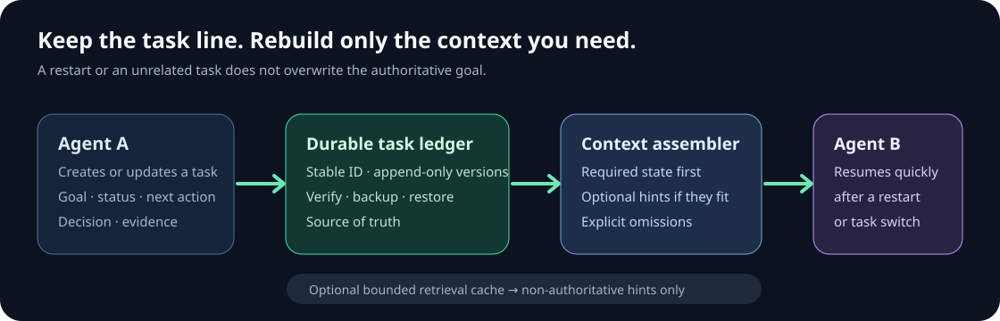
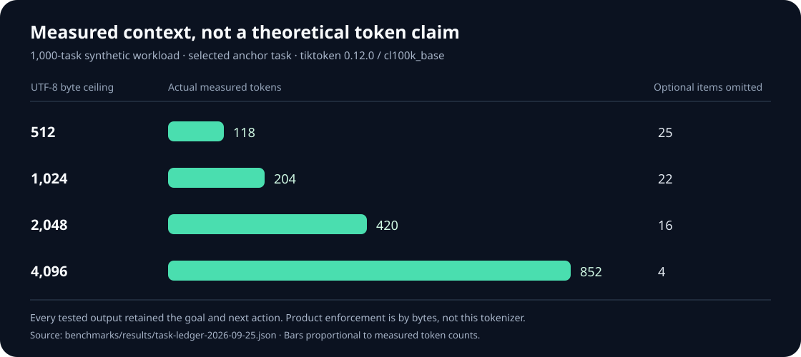

# ContextSpindle

**A durable task line for AI agents.** Keep the goal, decisions, and next action across context compaction, interrupted sessions, and unrelated work—then hand the next agent only the context it needs.

[中文说明](README_CN.md) · [Product definition](docs/PRODUCT-SCOPE.md) · [Agent protocol](docs/AGENT-PROTOCOL.md) · [Operations](docs/OPERATIONS.md) · [Measured results](docs/TASK-LEDGER-BENCHMARK.md)

## Why we built it

A long conversation can be compressed. An agent may switch to another task, restart, or return much later. If the only record of the original goal lives in a chat window or an evicting retrieval cache, the agent can lose the task line even while remembering scattered details. ContextSpindle separates the two jobs: a persistent task ledger keeps authoritative state; a bounded memory engine supplies optional retrieval hints. Resuming starts with the task, not with a dump of every conversation.



The ledger records a stable task ID, goal, completion criteria, status, owner, blocker, next action, parent and dependencies, decisions, evidence, notes, and version history. Updates are serialized across local processes; an expected version detects concurrent edits. Completed dependencies and a cleared blocker are required before marking a task done. Checksum verification, backup, and restore are built in. The `contextspindle task context` command keeps required state intact, includes optional information only if it fits, and reports omissions.

## What a user gets

- **A resumable handoff:** another agent can open the task ID and see what is being done, why, what remains, and what is blocked.
- **Less irrelevant input:** assemble one task's context instead of sending a list of every task. The measured example below shows the size difference for one explicit workload—not a universal savings promise.
- **Auditable changes:** previous versions, decisions, evidence references, and caller-declared actor labels remain available. Actor labels are provenance, not authentication.
- **Recovery independent of retrieval:** losing or corrupting the bounded `.continuum/` cache does not erase the `.contextspindle/tasks/` ledger. Verified backups can be restored into a fresh workspace.
- **A shared local interface:** agents can use the same CLI or 15 MCP tools without relying on one model's private chat history.

## Measured, not imagined

The [reproducible benchmark](benchmarks/task_ledger_product.py) created one anchor task with 24 notes and **999 unrelated tasks** in a fresh workspace. On an Apple M4 / macOS 26.6.2, a release CLI process recovered the anchor's 2,048-byte-budget context in **34.23 ms median** and **35.73 ms p95** across 11 sequential warm-cache runs. The goal and next action were present at every tested budget. The optional retrieval snapshot was then corrupted; the task remained readable. Backup into, and restore from, a fresh workspace also passed. [Raw JSON](benchmarks/results/task-ledger-2026-09-25.json) records the exact outputs and conditions.



| Same 1,000-task test, `cl100k_base` encoding | UTF-8 bytes | Measured tokens |
| --- | ---: | ---: |
| Naively concatenate all 10 paginated task-summary responses | 322,607 | 94,701 |
| Assemble only the anchor task with a 2,048-byte ceiling | 1,908 | 420 |

That selected context was **99.56% smaller in token count for this specific comparison**. The baseline is intentionally naive and the two inputs are not semantically identical. This is evidence that task selection can avoid unrelated input; it is **not** a claim that every user or model saves 99.56% of tokens. The product enforces a conservative UTF-8 byte ceiling, not a model-specific tokenizer. The reported token counts use `tiktoken` 0.12.0 with `cl100k_base` only. The tasks and notes were synthetic; the runtime, outputs, and counts are actual measurements.

| Operation on that 1,000-task workspace | Median | p95 | Runs |
| --- | ---: | ---: | ---: |
| Inbox, 10 tasks | 32.80 ms | 33.92 ms | 11 |
| Search for the anchor | 32.49 ms | 32.89 ms | 11 |
| Assemble anchor context, 2,048-byte ceiling | 34.23 ms | 35.73 ms | 11 |
| Verify all task records | 62.73 ms | 63.44 ms | 11 |

These timings include a fresh CLI process per call with a warm filesystem cache. They do not measure model response time, Linux, cold storage, very long per-task histories, or multi-year durability. The older bounded-memory research and its distinct benchmarks are in [BENCHMARKS.md](docs/BENCHMARKS.md); they are not task-ledger results.

We also used ContextSpindle to track this repository's own rename and publication task. Its version-3 handoff contained the real goal and next action in 1,892 bytes / 438 `cl100k_base` tokens; this is a [dogfood observation](docs/TASK-LEDGER-BENCHMARK.md#real-project-dogfood-observation), not an independently reproducible benchmark, because the operational ledger is Git-ignored.

## Try it locally

Build from this checkout—no global install, hook, or IDE setting change is needed:

```bash
cargo build --release --bin contextspindle
./target/release/contextspindle init .
./target/release/contextspindle task create \
  "Ship the release" --criteria "Tests pass and release is published" \
  --idempotency-key ship-release
```

Copy the returned task ID, then update and resume it:

```bash
./target/release/contextspindle task update TASK_ID \
  --status active --next "Run final tests" --expect-version 1
./target/release/contextspindle task inbox 10
./target/release/contextspindle task context TASK_ID 2048
./target/release/contextspindle task verify
./target/release/contextspindle task backup /path/to/new-backup-directory
```

Use `task search <query>` when an old ID is unknown, `task history <id>` to review changes, and `task restore <backup-directory>` in a new workspace. A task cannot be remembered if no agent ever records it. The [agent protocol](docs/AGENT-PROTOCOL.md) gives the full start/switch/stop workflow, and the [operations runbook](docs/OPERATIONS.md) explains backup and security responsibilities.

The project-scoped [`.mcp.json`](.mcp.json) starts the same server from this checkout. The task tools cover create, update, show, list, inbox, search, context, history, children, verification, backup, and restore. `contextspindle_remember`, `contextspindle_recall`, and `contextspindle_stats` remain available for the bounded cache. The legacy `continuum-cli` command, Python import, Rust crate names, and `.continuum/` snapshot paths remain for compatibility; see the [naming decision](docs/NAME-CHANGE.md).

## Limits worth knowing

The ledger is local and Git-ignored: **pushing code does not back up tasks**. Schedule protected, off-device backups and test restores if long-term continuity matters. Checksums detect accidental corruption, not malicious rewriting by a user who can edit the workspace. Task text and retrieved hints must be treated as data, not higher-priority instructions. Some list/search operations scan task directories, so measure your own workload before setting a scale target. Deterministic retrieval for a fixed snapshot does not make a language model's response deterministic.

[Source on GitHub](https://github.com/reacherwu/ContextSpindle) · [License](LICENSE)
